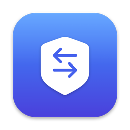
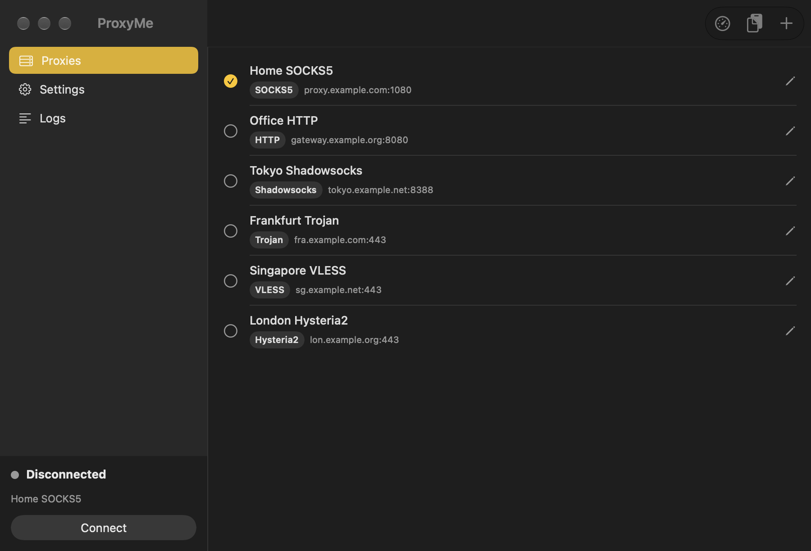
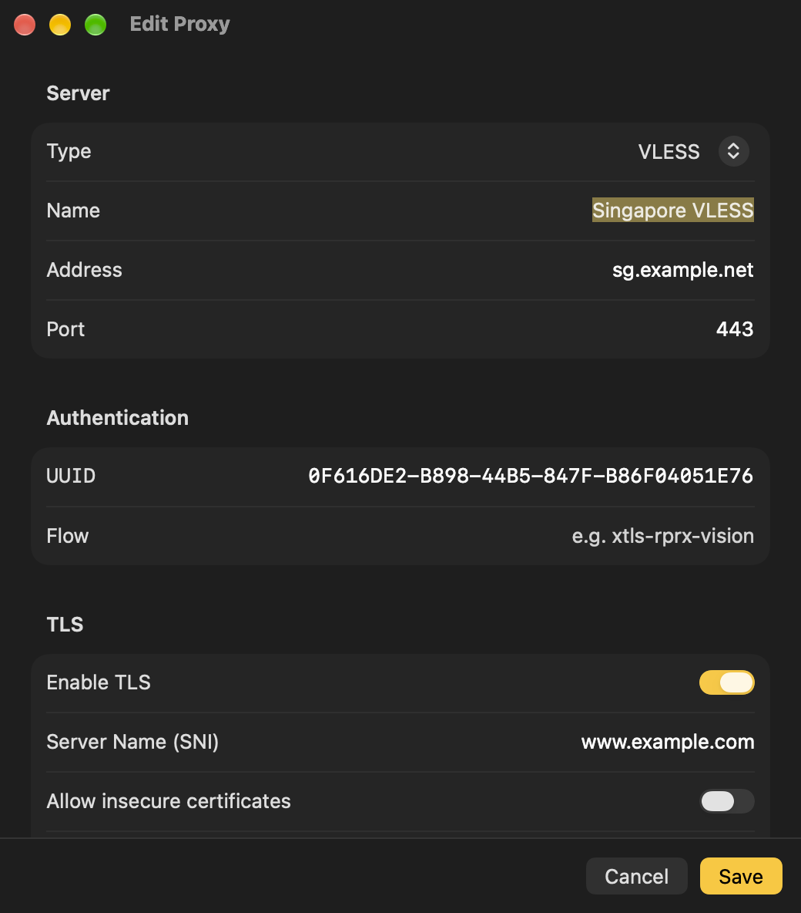
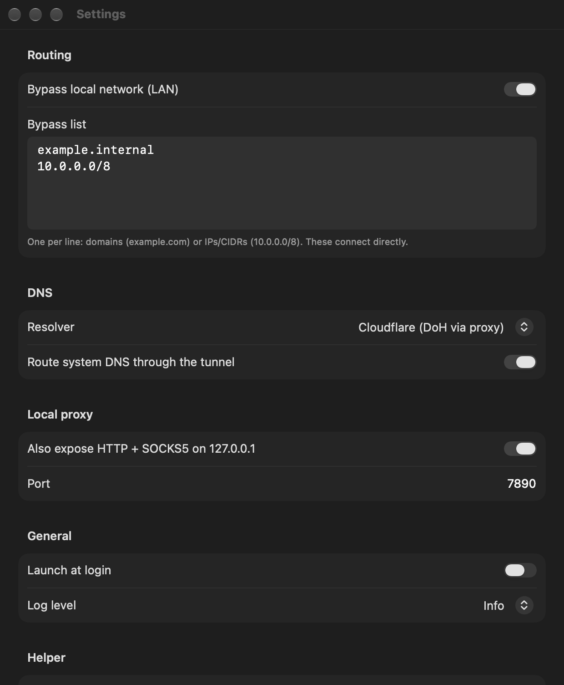

<p align="center">
  
</p>

<h1 align="center">ProxyMe</h1>

<p align="center">
  Route <b>everything</b> on your Mac through one proxy — browsers, Terminal, CLI tools,<br>
  and apps that ignore the system proxy settings.
</p>

<p align="center">
  
  
  
  
</p>

---

## Screenshots

<p align="center">
  
</p>
<p align="center">
  
  
</p>

## Features

- **Truly system-wide** — a TUN interface captures all traffic, so `curl`, `git`, `ssh`, `brew`
  and every GUI app go through the proxy with zero per-app configuration.
- **Many protocols** — SOCKS5, SOCKS4/4a, HTTP, HTTPS, Shadowsocks, Trojan, VMess,
  VLESS (incl. REALITY), Hysteria2. WebSocket and gRPC transports supported.
- **Import share links** — copy `socks5://`, `ss://`, `trojan://`, `vmess://`, `vless://`,
  `hysteria2://` links and import them from the clipboard.
- **No DNS leaks** — system DNS is pointed into the tunnel while connected and restored
  automatically on disconnect, crash, or restart.
- **Bypass rules** — keep LAN traffic and your own list of domains / CIDRs direct.
- **Local proxy too** — HTTP + SOCKS5 on `127.0.0.1:7890` for tools that want an explicit proxy.
- **Menu bar + window** — quick connect/switch from the menu bar; full management, latency
  tests and live logs in the main window.

## Requirements

- macOS 14 (Sonoma) or later, Apple Silicon or Intel
- Xcode 16 or later
- [XcodeGen](https://github.com/yonaskolb/XcodeGen) — `brew install xcodegen`
- An Apple Developer team (a free personal team works) for code signing

## Install

**Download:** grab the latest DMG from [Releases](https://github.com/awnigharbia/ProxyMe/releases/latest) and drag ProxyMe to Applications. The build is not notarized, so clear the quarantine flag once:

```bash
xattr -dr com.apple.quarantine /Applications/ProxyMe.app
```

**Or build from source:**

**1. Clone**

```bash
git clone https://github.com/awnigharbia/ProxyMe.git && cd ProxyMe
```

**2. Fetch the proxy core** (downloads a pinned, checksum-verified sing-box release)

```bash
./scripts/fetch-sing-box.sh
```

**3. Generate the Xcode project**

```bash
xcodegen generate
```

**4. Build** — replace `YOURTEAMID` with your Apple Developer team ID

```bash
xcodebuild -project ProxyMe.xcodeproj -scheme ProxyMe -configuration Release -derivedDataPath build DEVELOPMENT_TEAM=YOURTEAMID build
```

**5. Copy to Applications and launch**

```bash
cp -R build/Build/Products/Release/ProxyMe.app /Applications/ && open /Applications/ProxyMe.app
```

> The app must run from `/Applications` — macOS refuses to register the helper otherwise.

## First run

1. Click **+** to add a proxy (or copy a share link and use **Import from Clipboard**).
2. Select it and press **Connect**.
3. macOS asks to allow the background helper: open
   **System Settings → General → Login Items & Extensions** and enable **ProxyMe**.
4. Press **Connect** again. The menu bar shield fills in when the tunnel is up.

Verify from Terminal:

```bash
curl https://ifconfig.me
```

It should print your proxy's IP address.

## How it works

```
┌────────────┐   XPC    ┌────────────────┐  spawns  ┌──────────┐
│ ProxyMe.app│ ───────▶ │ ProxyMeHelper  │ ───────▶ │ sing-box │ ──▶ TUN ──▶ proxy
│ (SwiftUI)  │          │ (root, launchd)│          │  (root)  │
└────────────┘          └────────────────┘          └──────────┘
```

- **ProxyMe.app** turns your profile and settings into a sing-box configuration.
- **ProxyMeHelper** is a launchd daemon registered through `SMAppService`. It runs as root
  because creating a TUN device and editing routes requires it.
- **sing-box** creates the TUN interface, takes over the default route, and forwards traffic
  to your proxy.

### Security

- The helper only accepts XPC connections from the ProxyMe app signed by the same team.
- The core binary is copied to a root-owned directory and its signature is verified before
  it is executed, so a tampered app bundle can't run code as root.
- Configuration and logs written by the helper are readable by root only.

## Notes & limitations

- HTTP, HTTPS and SOCKS4/4a proxies can't carry UDP. UDP (e.g. QUIC) is rejected so apps
  fall back to TCP immediately.
- Proxy passwords are stored in `~/Library/Application Support/ProxyMe/state.json`
  (owner-only permissions), not in the Keychain.
- To remove the helper: **Settings → Helper → Uninstall Helper**, then delete the app.

## Development

```bash
xcodegen generate && open ProxyMe.xcodeproj
```

Regenerate the app icon with `swift scripts/make-icon.swift icon.png`.

## Acknowledgements

Powered by [sing-box](https://github.com/SagerNet/sing-box) (GPLv3), bundled unmodified as a
separate executable.

## License

ProxyMe's own source code is released under the [MIT License](LICENSE).

sing-box is not part of this repository; it is downloaded at build time and remains under
its own GPLv3 license. If you distribute a built `ProxyMe.app`, the bundled sing-box binary
must be distributed under the terms of the GPLv3.
